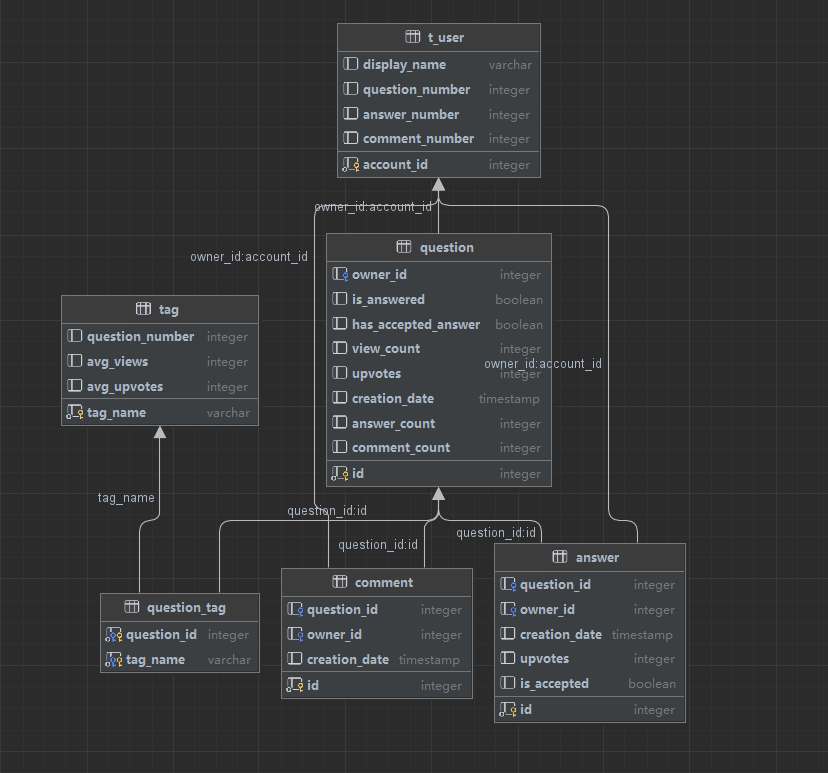

# SUSTech-CS209A-Project

## Instruction

本次Project主要内容为使用java爬虫技术在StackOverflow中爬取java相关数据并利用网页进行可视化展示。

## Start

1. git clone 仓库
2. 运行 SpringBoot 项目
3. 运行 Vue 项目
   1. 安装 node.js
   2. 进入 vue-project 文件夹
   3. 在 git bash 中运行 `npm install`. 该命令用于安装 vue-project 的依赖包
   4. 在 git bash 中运行 `npm run dev`. 该命令用于启动开发环境(即dev), 然后可以用浏览器在指定端口打开页面

## 设计与结构

### 技术栈

#### 爬虫

+ Http Request Generator
+ Json & Json Object Transfer
+ Java API Extractor

#### 后端

+ SpringBoot
+ MybatisPlus + PostgreSQL

#### 前端

+ Vue
+ Vue Router
+ Axios
+ Element Plus
+ Echarts

### 数据库设计



### Spring Boot 项目结构

+ config: 配置类
+ controller: 控制层
+ crawler & crawler_model: 爬虫相关，包括生成Http请求、生成json文件、转换json文本与对象
+ entity: 实体类，与数据库表一一对应
+ mapper: 用以 Mybatis 映射数据库

### Vue 项目结构

+ assets: 全局设置
+ components: 通用组件. 主要包含 Echarts 在 Vue 中的实现
+ icons: 图标
+ layout: 整体布局
  + Sidebar: 侧边栏
  + AppMain: 主体内容显示
  + Navbar: 导航栏
+ router: 路由配置
+ views: 主要视图, 将加载到 AppMain 中

## Insights

### 统计范围

600个问题，共计10306条回答，22259条评论

### 统计分析

1. 从问题、回答的发布时间来看，2015年之前java比较火爆，高质量问题较多；
2. 从问题解决时间来看，某些问题发布后1s内就被解决了，且发布问题的用户和解决问题的用户是用一个人，存在刷分现象；
3. 从与java相关的标签来看，Android、Spring、SpringBoot出现频率较多，表示移动端开发及SpringBoot框架比较热门；另外，arrays，list，string等java常用的工具出现频率也比较高。

## 部署服务器

### SpringBoot 项目

1. 在`application-pro.yml`配置文件中进行生产环境的配置

   ```yaml
   server:
     port: 8080
   
   spring:
     datasource:
       url: jdbc:postgresql://localhost:5432/<database>
       username: 
       password: 
   
   logging:
     level:
       root: INFO
   #    root: DEBUG
     file:
       name: /home/lighthouse/download/java2project.log
   ```

2. 在`application.yml`中确保:

   ```yaml
   spring:
     profiles:
       active: pro
   ```

3. 运行命令进行打包操作:

   ```
   mvn clean package -DskipTests
   ```

4. 将jar包上传到服务器中

5. 运行命令:

   ```
   nohup java -jar <jar包名>.jar &
   ```

   下面是对该命令的解释：

   - `nohup` 是一个命令，它允许在退出终端或注销用户之后继续在后台运行命令。它的作用是将命令与当前终端会话分离，使其在后台持续运行，不受终端关闭的影响。
   - `java -jar javaProject-0.0.1-SNAPSHOT.jar` 是要运行的 Java 可执行 JAR 文件。该命令使用 Java 运行时环境 (JRE) 来执行 JAR 文件，并启动相应的 Java 应用程序。
   - `&` 符号是用于将命令放入后台运行。它将命令放到一个子进程中执行，并立即返回命令提示符，允许你在后台继续执行其他命令。

### Vue 项目

1. 运行命令:

   ```
   npm run build
   ```

   工程将以html的形式打包在dist文件夹中

2. 将该文件夹上传至服务器中, 例如存在"/usr/app/dist"路径下

3. 在服务器中安装 nginx 服务器

   ```
   sudo apt update
   sudo apt install nginx
   ```

   在 Ubuntu 系统下，你可以使用以下命令来管理 Nginx：

   1. 启动 Nginx 服务：

      ```shell
      sudo systemctl start nginx
      ```

   2. 停止 Nginx 服务：

      ```shell
      sudo systemctl stop nginx
      ```

   3. 重启 Nginx 服务：

      ```shell
      sudo systemctl restart nginx
      ```

   4. 查看 Nginx 服务状态：

      ```shell
      sudo systemctl status nginx
      ```

4. 更改配置文件

   + 进入nginx配置应用的文件夹中:

     ```
     cd /etc/nginx/conf.d
     ```

   + 添加conf文件

     eg: `sudo vim vue.conf`

   + 在conf文件中写入

     ```
     server {
         listen      80;
         server_name localhost;
     
         location / {
             root /home/lighthouse/app/dist;
             index index.html;
         }
     }
     ```

     root 要改为dist所在路径

5. 重启Nginx服务

   ```
   sudo systemctl restart nginx
   ```

   
